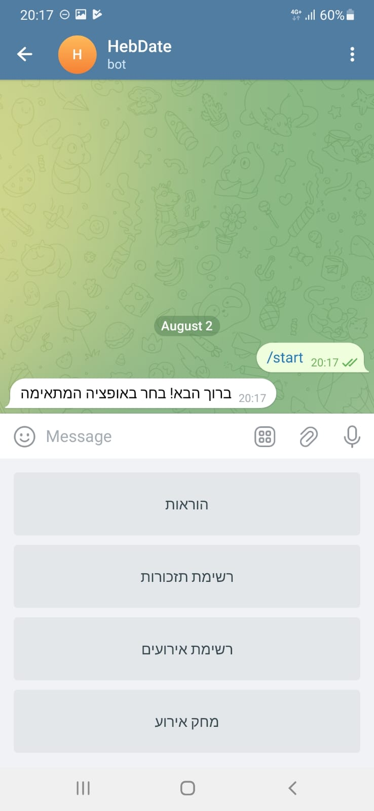
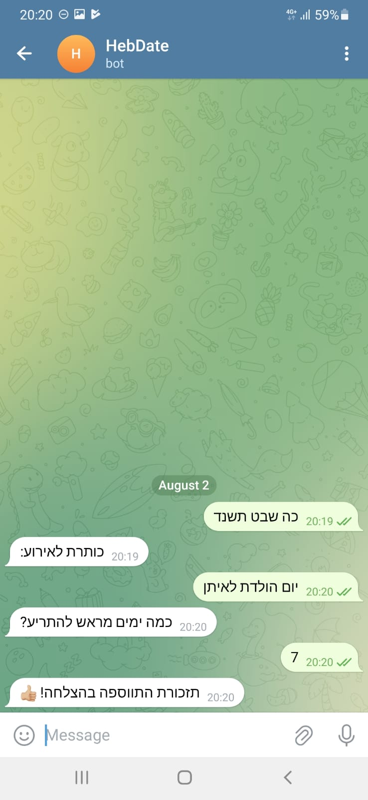

# Hebrew Events Reminder Telegram Bot

## Description

The Hebrew Events Reminder Telegram Bot is a Python-based bot that allows users to set reminders for events in Jewish
dates. The bot is designed to interact with users on the Telegram messaging platform.

## Usage

### Start the Bot:

Search for the bot on Telegram: **@HebDateBot**.
Click on the bot to start the conversation.

At the first usage or when you send *"/start"* command or *"התחל"*
the bot will display a handy keyboard with instructions and shortcuts

    
    

